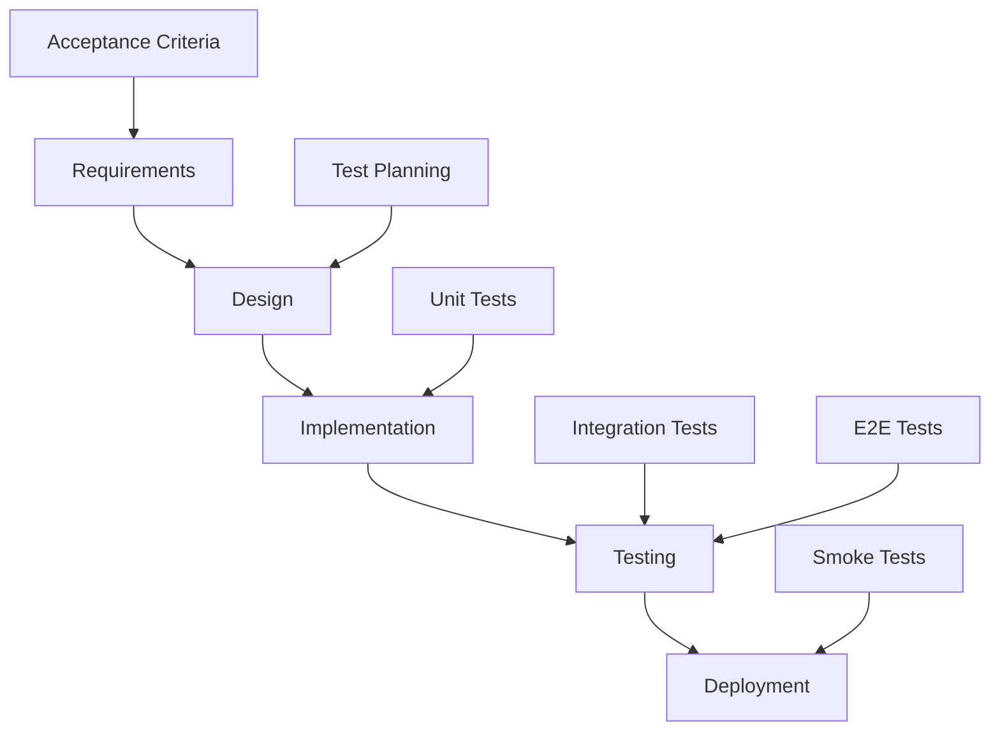

# ISTQB Foundation Level - Quality Platform Examples

This document maps Quality Platform features and testing practices to **ISTQB Foundation Level (CTFL)** concepts, providing practical examples for learning and certification preparation.

## 🎯 Learning Objectives

After studying this material with the Quality Platform examples, you will understand:

1. **Fundamentals of Testing** - Why testing is necessary and its principles
2. **Testing Throughout SDLC** - How testing integrates with development lifecycle
3. **Static Testing** - Reviews and static analysis techniques
4. **Test Techniques** - Black-box, white-box, and experience-based techniques
5. **Test Management** - Planning, monitoring, and control
6. **Test Tools** - Types and benefits of test automation tools

---

## 1. Fundamentals of Testing

### 1.1 What is Testing?

**ISTQB Definition**: Testing is a process consisting of all lifecycle activities, both static and dynamic, concerned with planning, preparation and evaluation of software products and related work products to determine that they satisfy specified requirements.

**Quality Platform Example**:
```typescript
// Example from our AuthService unit test
describe('AuthService', () => {
  it('should successfully register a new user', async () => {
    // Given: Valid user registration data (Test Input)
    const userData = { email: 'test@example.com', password: 'Pass123!', name: 'Test User' };

    // When: Registering the user (Exercise the SUT - System Under Test)
    const result = await authService.register(userData);

    // Then: User should be created and token returned (Expected Result)
    expect(result).toHaveProperty('access_token');
    expect(result.user.email).toBe(userData.email);
  });
});
```

**Key ISTQB Concepts Demonstrated**:
- **Test Case**: The complete test with Given-When-Then structure
- **Test Input**: `userData` object
- **Expected Result**: JWT token and user object structure
- **Actual Result**: What the system returns
- **Test Oracle**: Jest expectations that determine pass/fail

### 1.2 Why is Testing Necessary?

**ISTQB Concept**: Testing contributes to success by finding defects and failures, reducing risk, and providing information for decision making.

**Quality Platform Examples of Testing Benefits**:

1. **Preventing Defects**:
```typescript
// Contract test that prevents API breaking changes
it('GET /api/products should return expected pagination contract', async () => {
  const response = await request(app.getHttpServer())
    .get('/api/products')
    .expect(200);

  // This test prevents us from accidentally breaking the API contract
  expect(response.body).toHaveProperty('products');
  expect(response.body).toHaveProperty('pagination');
  expect(response.body.pagination).toHaveProperty('total');
});
```

2. **Risk Reduction**:
```typescript
// Security test that reduces business risk
it('should reject creation without admin privileges', async () => {
  await request(app.getHttpServer())
    .post('/api/products')
    .set('Authorization', `Bearer ${regularUserToken}`)
    .send(productData)
    .expect(403); // Prevents unauthorized product creation
});
```

### 1.3 Seven Testing Principles

**ISTQB Principle 1**: Testing shows the presence of defects, not their absence

**Quality Platform Example**:
```typescript
// This test can find bugs but cannot prove the login system is 100% bug-free
it('should throw UnauthorizedException with invalid password', async () => {
  prismaService.user.findUnique.mockResolvedValue(mockUser);
  mockedBcrypt.compare.mockResolvedValue(false);

  await expect(authService.login(loginDto)).rejects.toThrow(UnauthorizedException);
});
```

**ISTQB Principle 2**: Exhaustive testing is impossible

**Quality Platform Application**:
- We use **equivalence partitioning** for email validation (valid emails, invalid format, empty)
- We use **boundary value analysis** for price testing (0, 0.01, 999999.99)
- We focus testing on **high-risk areas** (authentication, payment processing)

**ISTQB Principle 3**: Early testing saves time and money

**Quality Platform Implementation**:
```typescript
// Static testing - ESLint catches issues before runtime
"rules": {
  "@typescript-eslint/no-unused-vars": "error",
  "prefer-const": "error"
}

// Unit tests catch business logic errors early
it('should calculate correct order total with tax', () => {
  const order = new Order(items, taxRate);
  expect(order.calculateTotal()).toBe(expectedTotal);
});
```

---

## 2. Testing Throughout the Software Development Lifecycle

### 2.1 Software Development Lifecycle Models

**ISTQB Concept**: Testing activities should be aligned with software development lifecycle models.

**Quality Platform SDLC Integration**:



**Testing Activities by Phase**:

1. **Requirements Phase**:
   - Review user stories for testability
   - Create acceptance criteria
   ```typescript
   // Example: User story with testable acceptance criteria
   /**
    * User Story: As a customer, I want to add items to my cart
    *
    * Acceptance Criteria:
    * - Item should be added with correct quantity
    * - Cart total should update automatically
    * - Stock should be validated before adding
    * - Guest users can add items without login
    */
   ```

2. **Design Phase**:
   - Create test strategy
   - Plan test automation approach
   - Design test data and environments

3. **Implementation Phase**:
   - Write unit tests alongside code (TDD)
   - Perform code reviews
   ```typescript
   // TDD Example: Write test first
   it('should add item to cart with correct quantity', async () => {
     const result = await cartService.addItem(productId, 2);
     expect(result.items).toHaveLength(1);
     expect(result.items[0].quantity).toBe(2);
   });

   // Then implement the functionality
   ```

### 2.2 Test Levels

**ISTQB Concept**: Tests are grouped into different levels based on scope and objectives.

#### 2.2.1 Component Testing (Unit Testing)

**Quality Platform Example**:
```typescript
// Testing individual service methods in isolation
describe('ProductService', () => {
  it('should validate product data before creation', () => {
    const invalidProduct = { name: '', price: -10 };

    expect(() => productService.validate(invalidProduct))
      .toThrow('Product name is required');
  });
});
```

**ISTQB Focus**: Testing individual software components in isolation

#### 2.2.2 Integration Testing

**Quality Platform Example**:
```typescript
// Testing interaction between ProductService and PrismaService
describe('Product Integration', () => {
  it('should create product in database', async () => {
    const product = await productService.create(validProductData);
    const savedProduct = await prismaService.product.findUnique({
      where: { id: product.id }
    });

    expect(savedProduct).toBeTruthy();
    expect(savedProduct.name).toBe(validProductData.name);
  });
});
```

**ISTQB Focus**: Testing interfaces and interaction between integrated components

#### 2.2.3 System Testing

**Quality Platform Example**:
```typescript
// Testing complete workflows through the API
describe('E-commerce System Tests', () => {
  it('should complete full purchase workflow', async () => {
    // 1. User registration
    const authResponse = await request(app)
      .post('/api/auth/register')
      .send(userData);

    // 2. Add products to cart
    await request(app)
      .post('/api/cart/items')
      .set('Authorization', `Bearer ${authResponse.body.access_token}`)
      .send({ productId: 1, quantity: 2 });

    // 3. Checkout process
    const order = await request(app)
      .post('/api/cart/checkout')
      .set('Authorization', `Bearer ${authResponse.body.access_token}`)
      .expect(201);

    expect(order.body).toHaveProperty('id');
    expect(order.body.status).toBe('PENDING');
  });
});
```

**ISTQB Focus**: Testing the behavior of an integrated system

#### 2.2.4 Acceptance Testing

**Quality Platform Example**:
```typescript
// Playwright E2E tests from user perspective
test('Customer can browse and purchase products', async ({ page }) => {
  // User story: As a customer, I want to buy a product online

  await page.goto('/');
  await page.click('text=Browse Products');

  // Select a product
  await page.click('[data-testid="product-card"]:first-child');
  await page.click('text=Add to Cart');

  // Go to checkout
  await page.click('[data-testid="cart-icon"]');
  await page.click('text=Checkout');

  // Verify order completion
  await expect(page.locator('text=Order Confirmed')).toBeVisible();
});
```

**ISTQB Focus**: Formal testing to determine whether system meets business requirements

---

## 3. Static Testing

### 3.1 Static Testing Basics

**ISTQB Definition**: Static testing relies on manual examination of work products or tool-driven evaluation of code without executing the code.

**Quality Platform Static Testing Examples**:

#### 3.1.1 Reviews

**Code Review Checklist** (based on ISTQB guidelines):
```typescript
// ✅ Good example following review criteria
export class AuthService {
  /**
   * Registers a new user in the system
   * @param createUserDto - User registration data
   * @returns Promise<AuthResponse> - JWT token and user info
   * @throws ConflictException - When user already exists
   * @throws ValidationException - When input data is invalid
   */
  async register(createUserDto: CreateUserDto): Promise<AuthResponse> {
    // Input validation
    if (await this.userExists(createUserDto.email)) {
      throw new ConflictException('User already exists');
    }

    // Secure password hashing
    const hashedPassword = await bcrypt.hash(createUserDto.password, 10);

    // Database transaction for consistency
    const user = await this.prisma.user.create({
      data: { ...createUserDto, password: hashedPassword }
    });

    return this.generateAuthResponse(user);
  }
}
```

**Review Criteria Applied**:
- ✅ Clear documentation
- ✅ Error handling
- ✅ Security best practices
- ✅ Consistent naming
- ✅ Single responsibility

#### 3.1.2 Static Analysis Tools

**ESLint Configuration** (Quality Platform):
```json
{
  "extends": ["@nx/typescript"],
  "rules": {
    "@typescript-eslint/no-unused-vars": "error",
    "@typescript-eslint/explicit-function-return-type": "warn",
    "prefer-const": "error",
    "no-var": "error"
  }
}
```

**Benefits Demonstrated**:
- Catches unused variables before runtime
- Enforces consistent code style
- Identifies potential security issues
- Improves maintainability

### 3.2 Review Process

**ISTQB Review Activities**:

1. **Planning**: Define review objectives and scope
2. **Initiate**: Distribute materials and assign roles
3. **Individual Review**: Reviewers examine work products
4. **Issue Communication**: Document and discuss findings
5. **Fixing and Reporting**: Address issues and track resolution

**Quality Platform Review Template**:
```markdown
# Code Review Checklist

## Functionality
- [ ] Code meets requirements
- [ ] Business logic is correct
- [ ] Error handling is appropriate

## Design
- [ ] Code follows SOLID principles
- [ ] Proper separation of concerns
- [ ] Consistent with existing patterns

## Security
- [ ] Input validation implemented
- [ ] No hardcoded secrets
- [ ] Authentication/authorization correct

## Performance
- [ ] No obvious performance issues
- [ ] Database queries are optimized
- [ ] Proper caching where needed

## Maintainability
- [ ] Code is readable and well-documented
- [ ] Tests cover the functionality
- [ ] Follows team coding standards
```

---

## 4. Test Design Techniques

### 4.1 Categories of Test Design Techniques

**ISTQB Classification**:
- Black-box techniques
- White-box techniques
- Experience-based techniques

#### 4.1.1 Black-box Techniques

**Technique**: **Equivalence Partitioning**

**Quality Platform Example**:
```typescript
describe('Email Validation - Equivalence Partitioning', () => {
  // Valid partition
  it.each([
    'user@example.com',
    'test.user@domain.co.uk',
    'user+tag@example.org'
  ])('should accept valid email: %s', (email) => {
    expect(validateEmail(email)).toBe(true);
  });

  // Invalid partition
  it.each([
    'invalid-email',
    '@domain.com',
    'user@',
    ''
  ])('should reject invalid email: %s', (email) => {
    expect(validateEmail(email)).toBe(false);
  });
});
```

**Technique**: **Boundary Value Analysis**

**Quality Platform Example**:
```typescript
describe('Product Price - Boundary Value Analysis', () => {
  // Lower boundary
  it('should reject price of 0', () => {
    expect(() => createProduct({ price: 0 }))
      .toThrow('Price must be greater than 0');
  });

  it('should accept minimum price of 0.01', () => {
    expect(() => createProduct({ price: 0.01 }))
      .not.toThrow();
  });

  // Upper boundary (assuming max price is 999999.99)
  it('should accept maximum price of 999999.99', () => {
    expect(() => createProduct({ price: 999999.99 }))
      .not.toThrow();
  });

  it('should reject price above maximum', () => {
    expect(() => createProduct({ price: 1000000 }))
      .toThrow('Price exceeds maximum allowed');
  });
});
```

**Technique**: **Decision Table Testing**

**Quality Platform Example** - User permissions:

| User Role | Product Action | Authenticated | Expected Result |
|-----------|----------------|---------------|-----------------|
| GUEST     | VIEW          | No            | ✅ Allow       |
| GUEST     | CREATE        | No            | ❌ Deny        |
| USER      | VIEW          | Yes           | ✅ Allow       |
| USER      | CREATE        | Yes           | ❌ Deny        |
| ADMIN     | VIEW          | Yes           | ✅ Allow       |
| ADMIN     | CREATE        | Yes           | ✅ Allow       |

```typescript
describe('Product Access Decision Table', () => {
  const testCases = [
    { role: 'GUEST', action: 'VIEW', auth: false, expected: 'ALLOW' },
    { role: 'GUEST', action: 'CREATE', auth: false, expected: 'DENY' },
    { role: 'USER', action: 'VIEW', auth: true, expected: 'ALLOW' },
    { role: 'USER', action: 'CREATE', auth: true, expected: 'DENY' },
    { role: 'ADMIN', action: 'CREATE', auth: true, expected: 'ALLOW' }
  ];

  testCases.forEach(({ role, action, auth, expected }) => {
    it(`${role} ${action} with auth=${auth} should ${expected}`, async () => {
      const result = await checkProductAccess(role, action, auth);
      expect(result).toBe(expected === 'ALLOW');
    });
  });
});
```

#### 4.1.2 White-box Techniques

**Technique**: **Statement Coverage**

**Quality Platform Example**:
```typescript
// Function to test
function calculateDiscount(price: number, userType: string): number {
  let discount = 0;                    // Statement 1

  if (price > 100) {                   // Statement 2
    discount = 0.1;                    // Statement 3
  }

  if (userType === 'PREMIUM') {        // Statement 4
    discount += 0.05;                  // Statement 5
  }

  return price * (1 - discount);       // Statement 6
}

// Test cases to achieve 100% statement coverage
describe('Statement Coverage Example', () => {
  it('covers all statements', () => {
    // Test case 1: price > 100, PREMIUM user (covers all statements)
    expect(calculateDiscount(150, 'PREMIUM')).toBe(127.5);

    // Test case 2: price <= 100, non-PREMIUM (covers statements 1,2,4,6)
    expect(calculateDiscount(50, 'REGULAR')).toBe(50);
  });
});
```

**Technique**: **Decision Coverage (Branch Coverage)**

**Quality Platform Example**:
```typescript
// Test cases to achieve 100% decision coverage
describe('Decision Coverage Example', () => {
  it('covers all decision outcomes', () => {
    // True branch: price > 100
    expect(calculateDiscount(150, 'REGULAR')).toBe(135);

    // False branch: price <= 100
    expect(calculateDiscount(50, 'REGULAR')).toBe(50);

    // True branch: userType === 'PREMIUM'
    expect(calculateDiscount(100, 'PREMIUM')).toBe(95);

    // False branch: userType !== 'PREMIUM'
    expect(calculateDiscount(100, 'REGULAR')).toBe(100);
  });
});
```

#### 4.1.3 Experience-based Techniques

**Technique**: **Error Guessing**

**Quality Platform Example**:
```typescript
describe('Error Guessing - Common Vulnerabilities', () => {
  it('should prevent SQL injection attempts', async () => {
    const maliciousEmail = "'; DROP TABLE users; --";

    await expect(authService.login({
      email: maliciousEmail,
      password: 'password'
    })).rejects.toThrow();
  });

  it('should handle very long input strings', async () => {
    const veryLongName = 'a'.repeat(10000);

    await expect(userService.create({
      name: veryLongName,
      email: 'test@example.com'
    })).rejects.toThrow('Name too long');
  });

  it('should handle concurrent user registrations', async () => {
    const userData = {
      name: 'Test User',
      email: 'concurrent@example.com',
      password: 'password123'
    };

    // Attempt to register same user simultaneously
    const promises = Array(5).fill(null).map(() =>
      authService.register(userData)
    );

    const results = await Promise.allSettled(promises);
    const successful = results.filter(r => r.status === 'fulfilled');

    // Only one registration should succeed
    expect(successful).toHaveLength(1);
  });
});
```

**Technique**: **Exploratory Testing**

**Quality Platform Exploratory Testing Session**:
```markdown
# Exploratory Testing Session

**Charter**: Explore the shopping cart functionality for 60 minutes

**Test Ideas Generated**:
- Add same product multiple times
- Add product while stock is being updated
- Navigate away and return to cart
- Try to add more items than available stock
- Test cart with expired session
- Add items in multiple browser tabs
- Test cart behavior on slow network

**Bugs Found**:
1. Cart total doesn't update when removing last item
2. Stock validation message is unclear
3. Cart icon doesn't update immediately on mobile

**Follow-up Tests to Create**:
- Automated test for cart total calculation
- Test for stock validation messages
- Mobile-specific cart tests
```

---

## 5. Test Management

### 5.1 Test Planning

**ISTQB Test Plan Structure** applied to Quality Platform:

#### Test Plan Document Example

```markdown
# Quality Platform Test Plan

## 1. Test Plan Identifier
QP-TP-001-v1.0

## 2. Introduction
This test plan covers testing for the Quality Platform e-commerce application.

## 3. Test Items
- Authentication Service (API)
- Product Management (API + UI)
- Shopping Cart (API + UI)
- Order Processing (API + UI)
- User Interface (Web Application)

## 4. Features to be Tested
### High Priority
- User registration and login
- Product browsing and search
- Cart management
- Order creation

### Medium Priority
- User profile management
- Product filtering
- Order history

### Low Priority
- Advanced search features
- Product recommendations

## 5. Features Not to be Tested
- Third-party payment processing (mocked)
- Email delivery (mocked)
- External integrations

## 6. Approach
### Test Levels
- Unit Testing: 70% coverage target
- Integration Testing: API contract validation
- System Testing: End-to-end user scenarios
- Acceptance Testing: Business requirements validation

### Test Types
- Functional Testing
- Security Testing
- Performance Testing
- Usability Testing
- Compatibility Testing

## 7. Item Pass/Fail Criteria
### Pass Criteria
- All critical and high priority test cases pass
- Code coverage >= 70%
- No critical security vulnerabilities
- Performance meets defined SLAs

### Fail Criteria
- Any critical test case fails
- Security vulnerabilities rated High or Critical
- Performance degrades by >20%

## 8. Testing Tasks
1. Test environment setup
2. Test data preparation
3. Test execution
4. Defect reporting and tracking
5. Test reporting

## 9. Environmental Needs
### Test Environment
- Development: Local environment
- Staging: Docker containers
- Production-like: CI/CD pipeline

### Test Data
- Seeded database with sample products
- Test user accounts (regular, admin)
- Mock external services

## 10. Responsibilities
- Developers: Unit tests, component tests
- QA Engineers: Integration, system, acceptance tests
- DevOps: Test environment maintenance
- Product Owner: Acceptance criteria validation

## 11. Staffing and Training Needs
- ISTQB Foundation Level certification preferred
- Training on test automation tools
- Domain knowledge of e-commerce systems

## 12. Schedule
- Test Planning: Week 1
- Test Design: Week 2-3
- Test Execution: Week 4-5
- Test Reporting: Week 6

## 13. Risks and Contingencies
### Risks
- Test environment instability
- Incomplete requirements
- Resource availability

### Mitigation
- Environment monitoring and backup plans
- Regular stakeholder communication
- Cross-training team members

## 14. Approvals
- Test Manager: [Signature]
- Project Manager: [Signature]
- Product Owner: [Signature]
```

### 5.2 Test Monitoring and Control

**ISTQB Concept**: Test monitoring gathers information about testing, while test control uses that information to guide testing.

**Quality Platform Monitoring Example**:
```typescript
// Test metrics collection
class TestMetrics {
  static collectMetrics() {
    return {
      testExecution: {
        total: 150,
        passed: 142,
        failed: 6,
        skipped: 2,
        passRate: (142/150 * 100).toFixed(1) + '%'
      },
      coverage: {
        statements: 85.2,
        branches: 78.9,
        functions: 92.1,
        lines: 84.7
      },
      defects: {
        open: 3,
        resolved: 12,
        critical: 0,
        high: 1,
        medium: 2,
        low: 0
      },
      riskAreas: [
        { area: 'Payment Processing', risk: 'High', mitigation: 'Extra testing cycles' },
        { area: 'User Authentication', risk: 'Medium', mitigation: 'Security review' }
      ]
    };
  }
}
```

**Test Control Actions Based on Metrics**:
```typescript
// Automated test control decisions
class TestController {
  static makeControlDecisions(metrics: TestMetrics) {
    const decisions = [];

    // Coverage control
    if (metrics.coverage.branches < 80) {
      decisions.push({
        action: 'ADD_BRANCH_TESTS',
        priority: 'HIGH',
        description: 'Branch coverage below threshold'
      });
    }

    // Failure rate control
    const failureRate = metrics.testExecution.failed / metrics.testExecution.total;
    if (failureRate > 0.05) { // More than 5% failure rate
      decisions.push({
        action: 'INVESTIGATE_FAILURES',
        priority: 'HIGH',
        description: 'Test failure rate exceeds acceptable threshold'
      });
    }

    return decisions;
  }
}
```

---

## 6. Tool Support for Testing

### 6.1 Test Tool Classification

**ISTQB Tool Categories** with Quality Platform examples:

#### 6.1.1 Test Management Tools

**Quality Platform Implementation**:
```json
// package.json - Test management scripts
{
  "scripts": {
    "test": "jest",
    "test:unit": "jest --testPathPattern=\\.spec\\.ts$",
    "test:integration": "jest --testPathPattern=\\.e2e\\.spec\\.ts$",
    "test:coverage": "jest --coverage",
    "test:watch": "jest --watch",
    "test:debug": "jest --detectOpenHandles",
    "e2e": "playwright test",
    "e2e:ui": "playwright test --ui",
    "quality:metrics": "node scripts/quality-metrics.js"
  }
}
```

#### 6.1.2 Static Analysis Tools

**ESLint Configuration**:
```json
{
  "extends": ["@nx/typescript"],
  "rules": {
    "@typescript-eslint/no-unused-vars": "error",
    "security/detect-sql-injection": "error",
    "security/detect-unsafe-regex": "error"
  }
}
```

#### 6.1.3 Test Design and Implementation Tools

**Jest (Unit Testing Framework)**:
```typescript
// Parameterized tests for better coverage
describe('Price Calculation', () => {
  it.each([
    [100, 0.1, 90],
    [50, 0.2, 40],
    [200, 0.15, 170]
  ])('calculates discounted price correctly: price=%d, discount=%f, expected=%d',
    (price, discount, expected) => {
      expect(calculateDiscountedPrice(price, discount)).toBe(expected);
    }
  );
});
```

**Playwright (E2E Testing Framework)**:
```typescript
// Visual regression testing
test('homepage visual comparison', async ({ page }) => {
  await page.goto('/');
  await expect(page).toHaveScreenshot('homepage.png');
});

// Cross-browser testing
test.describe('Cross-browser compatibility', () => {
  ['chromium', 'firefox', 'webkit'].forEach(browserName => {
    test(`works on ${browserName}`, async ({ browser }) => {
      const context = await browser.newContext();
      const page = await context.newPage();
      await page.goto('/');
      await expect(page.locator('h1')).toBeVisible();
    });
  });
});
```

#### 6.1.4 Test Execution and Logging Tools

**Quality Platform Test Runner**:
```typescript
// Custom test runner with enhanced reporting
class QualityTestRunner {
  async runAllTests() {
    const results = {
      unit: await this.runUnitTests(),
      integration: await this.runIntegrationTests(),
      e2e: await this.runE2ETests(),
      contract: await this.runContractTests()
    };

    return this.generateReport(results);
  }

  generateReport(results: TestResults) {
    return {
      summary: {
        total: results.unit.total + results.integration.total + results.e2e.total,
        passed: results.unit.passed + results.integration.passed + results.e2e.passed,
        failed: results.unit.failed + results.integration.failed + results.e2e.failed,
        duration: results.unit.duration + results.integration.duration + results.e2e.duration
      },
      details: results,
      recommendations: this.generateRecommendations(results)
    };
  }
}
```

### 6.2 Benefits and Risks of Test Automation

**ISTQB Benefits of Test Automation**:

1. **More tests run per build**
   ```yaml
   # CI/CD Pipeline - Quality Platform
   name: Quality Gates
   on: [push, pull_request]
   jobs:
     test:
       steps:
         - name: Run Unit Tests
           run: npm run test:unit
         - name: Run Integration Tests
           run: npm run test:integration
         - name: Run E2E Tests
           run: npm run e2e
         - name: Generate Coverage
           run: npm run test:coverage
   ```

2. **Reduction in repetitive manual work**
   ```typescript
   // Automated regression testing
   describe('Regression Tests - Order Processing', () => {
     // These tests run automatically on every code change
     it('maintains cart contents after login', async () => { /* ... */ });
     it('preserves shipping preferences', async () => { /* ... */ });
     it('calculates taxes correctly', async () => { /* ... */ });
   });
   ```

3. **Greater consistency and repeatability**
   ```typescript
   // Data-driven testing ensures consistent test conditions
   const testScenarios = [
     { userType: 'guest', expectedShipping: 'standard' },
     { userType: 'premium', expectedShipping: 'express' },
     { userType: 'admin', expectedShipping: 'priority' }
   ];

   testScenarios.forEach(scenario => {
     it(`applies correct shipping for ${scenario.userType}`, async () => {
       // Test runs exactly the same way every time
     });
   });
   ```

**ISTQB Risks of Test Automation**:

1. **Unrealistic expectations for automation**
   ```typescript
   // ❌ Bad: Trying to automate exploratory testing
   // Automation can't replace human creativity and intuition

   // ✅ Good: Automating repetitive, well-defined tests
   describe('API Contract Validation', () => {
     it('validates all endpoints return expected structure', async () => {
       // This is perfect for automation
     });
   });
   ```

2. **Maintenance overhead**
   ```typescript
   // Test maintenance strategy in Quality Platform
   class TestMaintenance {
     // Page Object Model reduces maintenance overhead
     static updateLoginPage(newSelector: string) {
       // Update in one place, affects all tests using this page
       this.loginPage.emailInput = newSelector;
     }

     // Automated test health checks
     static checkTestReliability() {
       return {
         flakyTests: this.identifyFlakyTests(),
         slowTests: this.identifySlowTests(),
         obsoleteTests: this.identifyObsoleteTests()
       };
     }
   }
   ```

---

## 7. ISTQB Exam Preparation

### 7.1 Sample Questions with Quality Platform Context

**Question 1**: Which of the following is a characteristic of good testing?
A) Testing shows that defects are NOT present
B) Testing should start as late as possible
C) Testing everything is possible and necessary
D) Testing shows that defects ARE present

**Answer**: D
**Explanation**: This relates to ISTQB Principle 1. In our Quality Platform, our tests like `should throw UnauthorizedException with invalid password` demonstrate finding defects, not proving their absence.

**Question 2**: Which test level would be MOST appropriate for testing the interaction between the AuthService and PrismaService?
A) Component testing
B) Integration testing
C) System testing
D) Acceptance testing

**Answer**: B
**Explanation**: Integration testing focuses on interfaces between components. Testing AuthService (business logic) interacting with PrismaService (data layer) is integration testing.

**Question 3**: Given the following decision table for user permissions:

| Condition | Rule 1 | Rule 2 | Rule 3 | Rule 4 |
|-----------|--------|--------|--------|--------|
| User Role = Admin | T | T | F | F |
| Authenticated = True | T | F | T | F |
| Action | Allow | Deny | Deny | Deny |

What is the minimum number of test cases needed to achieve 100% decision table coverage?
A) 2
B) 3
C) 4
D) 8

**Answer**: C
**Explanation**: Decision table coverage requires testing each rule (column) at least once. There are 4 rules, so minimum 4 test cases needed.

### 7.2 Key Terms Glossary

**Quality Platform Examples for ISTQB Terms**:

- **Defect**: Bug in AuthService that allows SQL injection
- **Error**: Developer mistake in validation logic
- **Failure**: Shopping cart total shows incorrect amount to user
- **Fault**: Incorrect conditional statement in discount calculation
- **Test Case**: Complete test including preconditions, inputs, expected results
- **Test Suite**: All authentication tests grouped together
- **Test Harness**: Jest framework setup with mocks and fixtures
- **Test Oracle**: Jest expectations that determine pass/fail
- **Traceability**: Linking test cases to user stories and requirements

---

## 8. Practical Exercises

### 8.1 Exercise 1: Create Test Cases

**Scenario**: Design test cases for the Product Search functionality

**Requirements**:
- Users can search products by name
- Search should be case-insensitive
- Empty search returns all products
- Search supports partial matches
- Maximum 50 results per page

**Your Task**: Create test cases using black-box techniques

**Solution Template**:
```typescript
describe('Product Search Test Cases', () => {
  // Equivalence Partitioning
  describe('Valid Search Terms', () => {
    it('should find products with exact name match', async () => { });
    it('should find products with partial match', async () => { });
    it('should handle case-insensitive search', async () => { });
  });

  describe('Invalid Search Terms', () => {
    it('should handle empty search', async () => { });
    it('should handle special characters', async () => { });
  });

  // Boundary Value Analysis
  describe('Search Result Limits', () => {
    it('should limit results to 50 per page', async () => { });
    it('should handle search with 51+ results', async () => { });
  });
});
```

### 8.2 Exercise 2: Review Checklist

**Scenario**: Review this code using ISTQB review principles

```typescript
async function updateStock(productId, newStock) {
  const product = await db.product.findUnique({where: {id: productId}});
  product.stock = newStock;
  await db.product.update({where: {id: productId}, data: product});
  return product;
}
```

**Your Task**: Identify issues using static testing principles

**Issues to Find**:
- [ ] Missing error handling
- [ ] Missing input validation
- [ ] Missing type definitions
- [ ] Potential null reference
- [ ] Inefficient database usage

---

## 9. Conclusion

The Quality Platform demonstrates practical application of all major ISTQB Foundation Level concepts:

✅ **Fundamentals**: Tests show presence of defects through systematic validation
✅ **SDLC Integration**: Testing activities aligned with development phases
✅ **Static Testing**: Code reviews and static analysis tools
✅ **Test Techniques**: Black-box, white-box, and experience-based approaches
✅ **Test Management**: Planning, monitoring, and control processes
✅ **Tool Support**: Comprehensive test automation framework

### Key Takeaways

1. **Testing is a process**, not just execution - it includes planning, design, and evaluation
2. **Early testing saves time and money** - unit tests catch issues before integration
3. **Risk-based testing** focuses effort where it matters most
4. **Test automation** amplifies testing capabilities but requires strategic thinking
5. **Continuous improvement** through metrics and retrospectives

### Next Steps

1. **Practice** with the Quality Platform codebase
2. **Study** ISTQB Foundation Level syllabus
3. **Take** practice exams
4. **Apply** concepts in real projects
5. **Pursue** ISTQB certification

---

*"Quality is not an accident. It is the result of intelligent effort, proper planning, and skillful execution."* - John Ruskin

**The Quality Platform makes ISTQB concepts practical and achievable.**